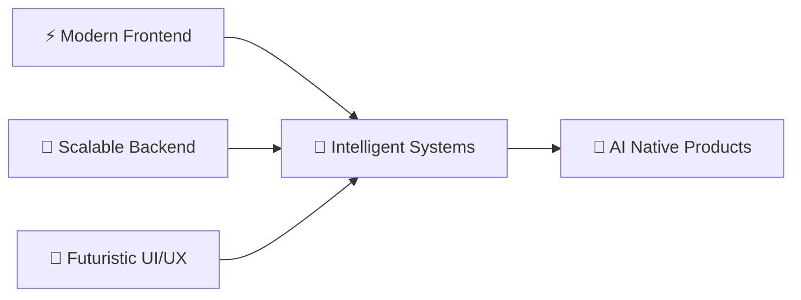

<div align="center">


</div>

<div align="center">


<br/>


</div>

---

# 🌌 About Me


### 🧠 Engineering Beyond Traditional Software

I’m a **Full Stack Engineer** passionate about building intelligent digital systems where:




</br>
</br>
</br>
</br>
</br>


My work combines:

* ⚡ High-performance frontend engineering
* 🧠 AI-driven workflows & automation
* 🚀 Scalable backend architectures
* 🌌 Futuristic interfaces & immersive experiences
* 🤖 Human-centered intelligent systems

I enjoy building products that feel:

> **Modern • Intelligent • Interactive • Scalable • Futuristic**

<br/>

<div align="center">


</div>

---

# ⚡ Tech Ecosystem

<div align="center">


</div>

---

# 🛰️ AI • FULLSTACK • FUTURE SYSTEMS

<table>
<tr>

<td width="33%" valign="top">

## 🎨 Frontend Intelligence

<div align="center">


</div>

```diff
+ React Ecosystem
+ Next.js Applications
+ Motion UI Systems
+ GSAP & Framer Motion
+ Interactive Experiences
+ Futuristic Interfaces
```

</td>

<td width="33%" valign="top">

## ⚙️ Backend Architecture

<div align="center">


</div>

```diff
+ Python Engineering
+ FastAPI Services
+ NestJS APIs
+ Scalable Architectures
+ Authentication Systems
+ Performance Optimization
```

</td>

<td width="33%" valign="top">

## 🧠 AI Engineering

<div align="center">


</div>

```diff
+ LLM Applications
+ RAG Pipelines
+ AI Copilots
+ Automation Systems
+ Computer Vision
+ Intelligent Workflows
```

</td>

</tr>
</table>

---

# 🌌 Activity Dashboard

<div align="center">


</div>

<br/>

<div align="center">


</div>

---

# 📡 Contribution Graph

<div align="center">


</div>

---

# 🐍 Contribution Snake Animation

<div align="center">


</div>

---

# 🏆 Galactic Achievements

<div align="center">


</div>

---

# 🌐 Connect Across The Galaxy

<div align="center">

<a href="https://linkedin.com/in/cirilplackal">

</a>

<a href="https://twitter.com/cplackal">

</a>

<a href="https://instagram.com/cirilplackal">

</a>

<a href="https://www.leetcode.com/cirilplackal">

</a>

<a href="https://cirilplackal.vercel.app">

</a>

</div>

---

# ⚡Terminal Interface

<div align="center">


</div>

<br/>

<div align="center">

```console id="w8mz0a"
┌──────────────────────────────────────────────────────────────────────────────┐
│                                                                              │
│  ███╗   ██╗███████╗██╗   ██╗██████╗  █████╗ ██╗                            │
│  ████╗  ██║██╔════╝██║   ██║██╔══██╗██╔══██╗██║                            │
│  ██╔██╗ ██║█████╗  ██║   ██║██████╔╝███████║██║                            │
│  ██║╚██╗██║██╔══╝  ██║   ██║██╔══██╗██╔══██║██║                            │
│  ██║ ╚████║███████╗╚██████╔╝██║  ██║██║  ██║███████╗                       │
│  ╚═╝  ╚═══╝╚══════╝ ╚═════╝ ╚═╝  ╚═╝╚═╝  ╚═╝╚══════╝                       │
│                                                                              │
│                     AI-FIRST ENGINEERING TERMINAL                            │
├──────────────────────────────────────────────────────────────────────────────┤
│                                                                              │
│  $ boot --initialize future-tech-environment                                │
│                                                                              │
│  [████████████████████] Frontend Systems .............. ONLINE ✓            │
│  [████████████████████] Backend Architecture .......... ACTIVE ✓            │
│  [████████████████████] AI Neural Modules ............. CONNECTED ✓         │
│  [████████████████████] RAG Pipelines ................. RUNNING ✓           │
│  [████████████████████] Motion UI Engine .............. ENABLED ✓           │
│  [████████████████████] Automation Systems ............ SYNCHRONIZED ✓      │
│  [████████████████████] Future Infrastructure ......... OPERATIONAL ✓       │
│                                                                              │
├──────────────────────────────────────────────────────────────────────────────┤
│                                                                              │
│  USER                :: CIRIL PLACKAL                                       │
│  ROLE                :: FULL STACK ENGINEER                                 │
│  SPECIALIZATION      :: AI • FULLSTACK • FUTURE SYSTEMS                     │
│  PRIMARY STACK       :: REACT • NEXTJS • PYTHON • FASTAPI                   │
│  AI STATUS           :: NEURAL NETWORKS ACTIVE                              │
│  SYSTEM MODE         :: FUTURE_READY                                        │
│                                                                              │
├──────────────────────────────────────────────────────────────────────────────┤
│                                                                              │
│  $ mission-status                                                     v2.0  │
│                                                                              │
│  → Building intelligent digital ecosystems                                  │
│  → Engineering AI-native applications                                       │
│  → Exploring neural architectures & automation                              │
│  → Designing futuristic user experiences                                    │
│                                                                              │
└──────────────────────────────────────────────────────────────────────────────┘

> SYSTEM STATUS :: READY TO ENGINEER THE FUTURE 🚀
```

</div>

<br/>

<div align="center">


</div>


---

<div align="center">

### 🌌 “The future belongs to engineers who build beyond imagination.”

<br/>


</div>
